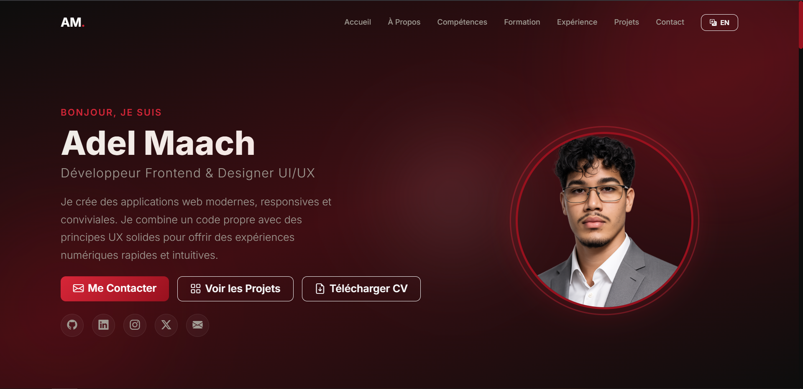
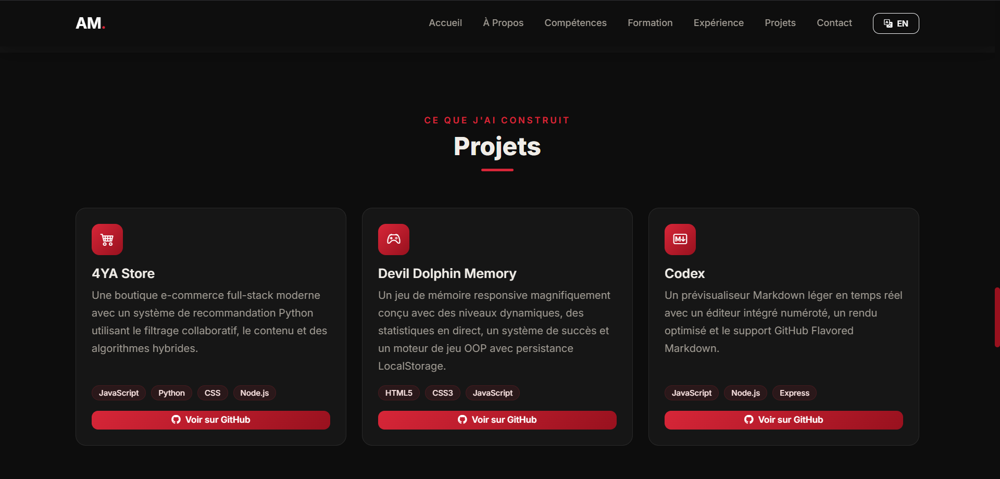
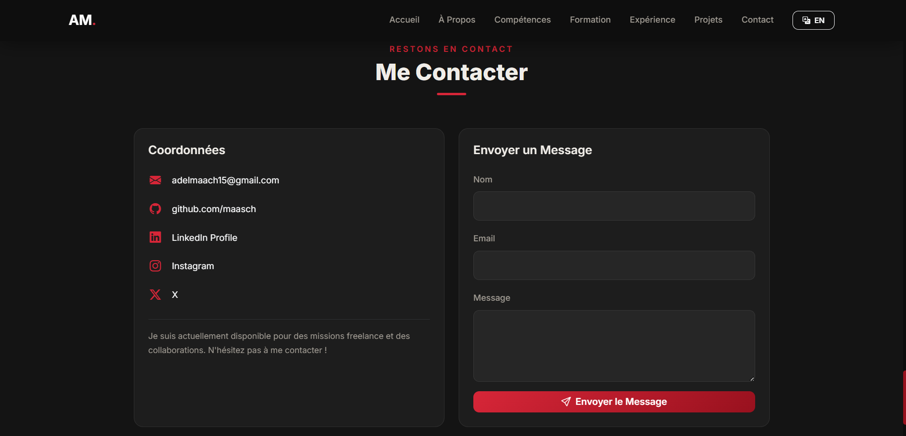

# 🌐 Adel Maach — Portfolio Website

A professional, responsive, bilingual (EN/FR) portfolio website built with **Bootstrap 5** and custom CSS. Deployed on **GitHub Pages**.

🔗 **Live Site:** [https://maasch.github.io](https://maasch.github.io)

---

## 📸 Screenshots

### Hero Section


### Projects Section


### Contact Section


---

## ✨ Features

- **Responsive Design** — Mobile, tablet, and desktop layouts
- **Bilingual** — English / French toggle with no page reload
- **7 Project Cards** — Built from real GitHub repositories
- **Contact Form** — Powered by [Formspree](https://formspree.io)
- **Dark Theme** — Custom bordeaux/crimson color palette
- **Scroll Animations** — Smooth reveal effects on scroll
- **CV Download** — One-click PDF download button

---

## 🛠️ Technologies Used

| Technology | Usage |
|---|---|
| **HTML5** | Semantic structure |
| **CSS3** | Custom styles, animations, responsive design |
| **JavaScript (ES6)** | Language toggle, form handling, scroll effects |
| **Bootstrap 5** | Grid, navbar, cards, buttons, forms, badges |
| **Bootstrap Icons** | Icon library |
| **Google Fonts (Inter)** | Modern typography |
| **Formspree** | Contact form backend |
| **GitHub Pages** | Hosting & deployment |

---

## 📁 Project Structure

```
├── index.html              # Main page (all sections)
├── README.md
└── assets/
    ├── css/
    │   └── style.css       # Custom styles & color palette
    ├── js/
    │   └── language-toggle.js  # EN/FR translation system
    ├── cv/
    │   └── Adel_Maach_CV.pdf   # Downloadable CV
    └── img/
        ├── profile.png     # Profile photo
        ├── favicon.png     # Browser tab icon
        └── screenshots/    # README screenshots
```

---

## 🚀 Deployment

This site is deployed via **GitHub Pages** from the `main` branch.

To deploy your own:

```bash
git init
git add .
git commit -m "Initial commit"
git branch -M main
git remote add origin https://github.com/YOUR_USERNAME/YOUR_USERNAME.github.io.git
git push -u origin main
```

Then enable Pages in **Settings → Pages → Source: Deploy from branch → main**.

---

## 🔗 Links

- **Portfolio:** [https://maasch.github.io](https://maasch.github.io)
- **GitHub:** [github.com/maasch](https://github.com/maasch)
- **LinkedIn:** [linkedin.com/in/adel-maach](https://www.linkedin.com/in/adel-maach/)
- **Instagram:** [instagram.com/addyyyyyyyyyyyy_](https://www.instagram.com/addyyyyyyyyyyyy_/)
- **X (Twitter):** [x.com/adel_maach](https://x.com/adel_maach)
- **Email:** adelmaach15@gmail.com

---

## 📄 License

© 2025 Adel Maach. All rights reserved.
